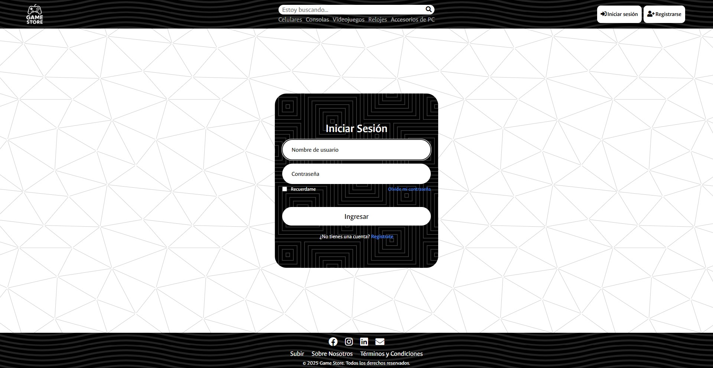
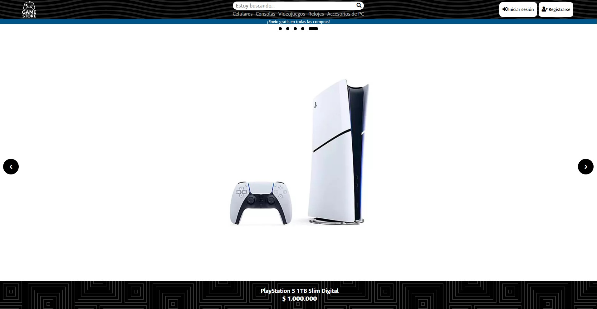
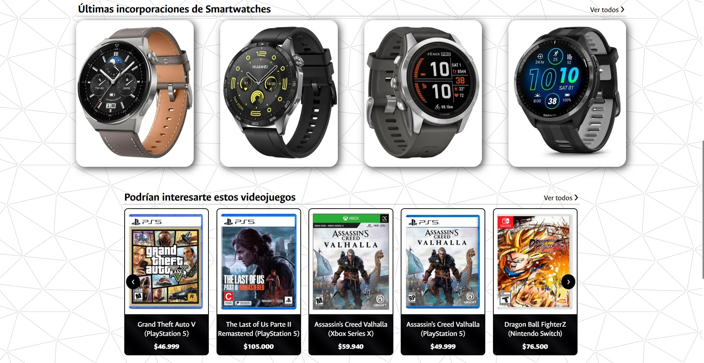
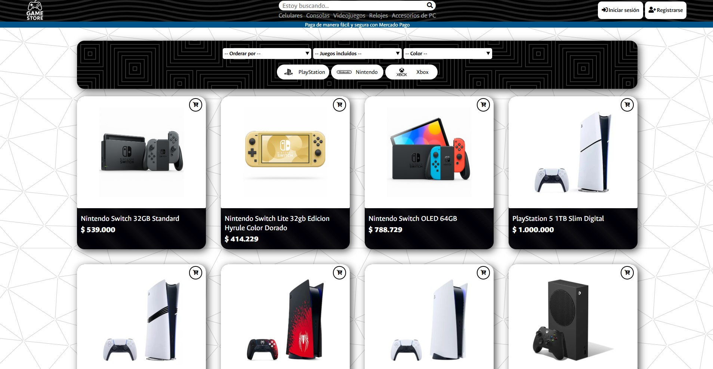
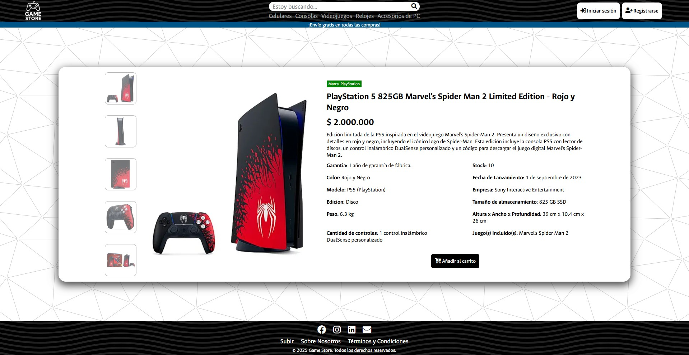
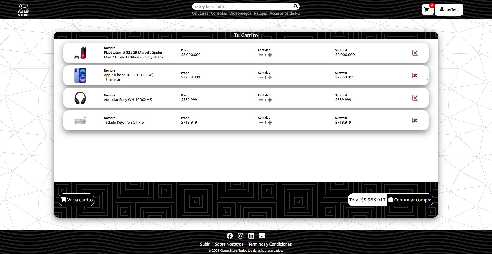
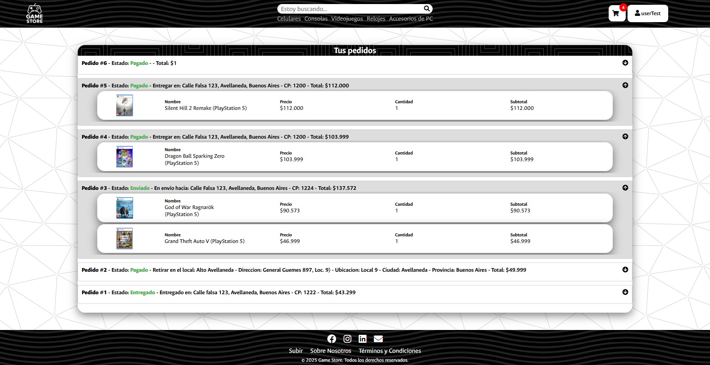
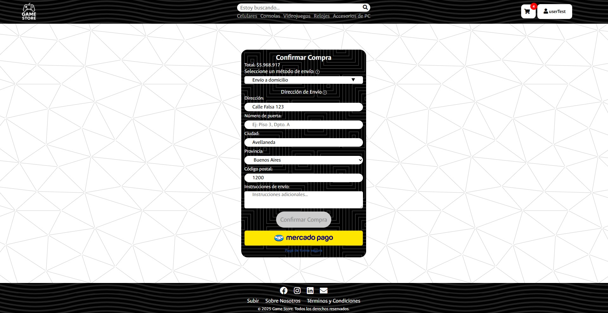

# Game Store - Sistema E-commerce en Django

**Game Store** es una plataforma e-commerce desarrollada con **Django**, que permite comprar videojuegos, consolas, celulares, relojes inteligentes y accesorios de PC. Incluye un sistema completo de carrito, pedidos, usuarios, retiro en tiendas físicas, direcciones de envío, control de stock, , pagos con MercadoPago, y filtros dinámicos para facilitar la navegación. Completamente contenedorizado con **Docker y Docker Compose** para facilitar su instalación y despliegue.










---

## Funcionalidades Principales

### ** Gestión de Usuarios ("Aplicación Usuarios") **
  - Sistema de usuarios personalizado (`CustomUser`).
  - Asociación de usuarios con los modulos de Pedido, DireccionEnvio y Carrito.

### ** Página Principal **
- Muestra una selección aleatoria de productos variados.

- Visualización destacada de los últimos relojes agregados y productos recomendados por categoría (juegos, celulares, accesorios).

- Totalmente dinámica: se actualiza con cada nuevo producto agregado.

### ** Tienda ("Aplicación Tienda") **
  - Incluye cinco categorías principales:
    - Videojuegos
    - Consolas
    - Celulares
    - Relojes Inteligentes
    - Accesorios de PC
  - Cada sección cuenta con:
    - Filtros por marca, tipo, color, consola/plataforma, género, almacenamiento, juegos incluidos, etc.
    - Ordenamiento por precio o nombre (ascendente y descendente).
    - Vista de detalle con información ampliada.

### ** Carrito de Compras ("Aplicación Carrito") **
  - Permite agregar productos desde distintas categorías al carrito (videojuegos, consolas, celulares, relojes inteligentes y accesorios de PC).
  - Uso de `GenericForeignKey` para gestionar múltiples tipos de productos en una única estructura de carrito (`LineaCarrito`).
  - Reserva de stock automática que reserva los productos por usuario durante 15 minutos mediante un modelo de `ReservaStock`.
  - Confirmación de pedidos con elección de envío o retiro en tienda.    

### ** Sistema de Pedidos **
  - Los pedidos pueden tener estado (enviado, cancelado, etc.).
  - Las reservas de stock se vinculan con el pedido para asegurar la disponibilidad.
  - Gestión de pedidos por usuario.
  - Confirmación de pedidos y vinculación con direcciones de envío o retiro por sucursal.

### ** Integración con MercadoPago **
  - Integración completa con la API oficial de MercadoPago (`Checkout Pro`):
  - Excluye métodos como pago en efectivo o cajero (atm, ticket).    
  - Se crea el objeto `Pedido` y se registran las líneas (`LineaPedido`).
  - Limpieza completa del carrito y de las sesiones tras el pago exitoso.


---

## Apps del Proyecto

| App          | Propósito                                                                |
|--------------|--------------------------------------------------------------------------|
| `usuarios`   | Usuarios personalizados, autenticación, datos extra                      |
| `carrito`    | Carrito, pedidos, direcciones, stock                                     |
| `tienda`     | Modelos para consolas, juegos, celulares, smartwatches y accesorios      |

---

## Tecnologías Utilizadas

| Tecnología       | Descripción                                      |
|------------------|--------------------------------------------------|
| Django           | Framework backend principal                      |
| SQLite           | Base de datos por defecto para desarrollo        |
| Docker           | Contenedorización                                |
| Docker Compose   | Orquestación de servicios                        |
| HTML/CSS         | Maquetación responsive y diseño visual adaptable. |
| JavaScript       | Funcionalidades personalizadas del lado del cliente. |
| MercadoPago SDK  | Integración de pasarela de pago con checkout automático. |
| ContentType / GenericForeignKey	  | Sistema flexible para manejar múltiples tipos de productos en el carrito y pedidos. |

---

## Instalación y configuración

### Instalación con Docker 

#### 1. Clonar el repositorio
```bash
git clone https://github.com/Maxiiii22/sistema-gamestore.git
cd sistema-gamestore/game_store
```

#### 2. Crear el archivo `.env`
Copiar el archivo de ejemplo:
```bash
cp .env.example .env
```

Abra el archivo `.env` recientemente creado y configure las siguientes variables obligatorias y opcionales:
##### Pasarela de Pagos (Mercado Pago)
* `MERCADOPAGO_PUBLIC_KEY`: Clave pública provista por el panel de desarrolladores de Mercado Pago para la inicialización del frontend.
* `MERCADOPAGO_ACCESS_TOKEN`: Token de acceso privado para la autenticación de peticiones API desde el backend de Django.

##### Servidor Proxy (Ngrok)
* `NGROK_AUTHTOKEN`: Token de autenticación requerido para establecer el túnel HTTPS dinámico. Puede obtenerlo registrándose de forma gratuita en [ngrok.com](https://ngrok.com).

##### Servicio de Mensajería (Opcional)
* `EMAIL_GAMESTORE`: Dirección de correo electrónico emisora para las notificaciones y bienvenidas de nuevos usuarios.
* `EMAIL_PASSWORD_GAMESTORE`: Contraseña de aplicación o credencial de autenticación del servicio SMTP.
* `DEFAULT_FROM_EMAIL_GAMESTORE`: Remitente por defecto que se visualizará en las cabeceras de los correos salientes.

#### 3. Compilar y levantar el entorno
Ejecute el siguiente comando para construir las imágenes de los contenedores e iniciar los servicios en red:
```bash
docker compose up --build
```

**Automatizaciones del ciclo de vida en Docker:**
Al iniciar por primera vez, el orquestador ejecutará automáticamente las siguientes tareas antes de habilitar el tráfico:
1.  Construcción de la imagen optimizada para Django.
2.  Ejecución del motor de migraciones sobre la base de datos local (SQLite).
3.  Poblamiento de registros y datos iniciales en el sistema.
4.  Puesta en marcha del servidor de desarrollo de Django y el cliente del túnel Ngrok.

#### 4. Acceso al sistema
Una vez que el ciclo de inicialización finalice de manera exitosa, el contenedor de diagnóstico imprimirá directamente en la consola la URL pública generada de manera dinámica por Ngrok:
```text
==================================================
 URL PÚBLICA DE NGROK LISTA:
 ---> https://ngrok-free.app
==================================================
```

Use ese enlace generado en su navegador para interactuar con el sistema y realizar pruebas de integración con las pasarelas de pago de forma remota.

---

#### Detener el proyecto
```bash
docker compose down
```

Si además deseas eliminar los volúmenes:
```bash
docker compose down -v
```

---

### Instalación manual


> Esta opción está pensada para desarrolladores que deseen ejecutar el proyecto sin Docker. Para la mayoría de los casos se recomienda utilizar la instalación mediante Docker.
> **Restricción de Mercado Pago:** Al ejecutar el servidor localmente bajo `localhost` o `127.0.0.1` sin el puente de Ngrok, la plataforma de Mercado Pago no podrá validar de manera externa los formularios ni procesar las solicitudes de pago de prueba (Sandbox). La pasarela de pagos quedará inhabilitada en esta modalidad.

#### 1. Clonar el repositorio e ingresar al directorio
```bash
git clone https://github.com
cd sistema-gamestore/game_store
```

#### 2. Configurar el entorno virtual e instalar dependencias
**Creación del entorno virtual:**
```bash
python -m venv venv
```

**Activación del entorno según el sistema operativo:**
*   **En sistemas operativos Windows (Command Prompt / Git Bash):**
    ```bash
    source venv/Scripts/activate
    ```
*   **En sistemas operativos Linux / macOS:**
    ```bash
    source venv/bin/activate
    ```

**Instalación del manifiesto de dependencias:**
Una vez activo el entorno virtual, actualice el gestor de paquetes e instale los módulos requeridos:
```bash
pip install --upgrade pip
pip install -r requirements.txt
```

#### 3. Configurar las variables de entorno
Genere el archivo de configuración local a partir de la plantilla provista en el repositorio:
```bash
cp .env.example .env
```
*Abra el archivo `.env` resultante y complete los parámetros de Mercado Pago y Ngrok tal como se detalla en la sección de configuración de Docker.*

#### 4. Inicializar la base de datos y aplicar migraciones
```bash
python manage.py migrate
```

#### 5. Iniciar el servidor de desarrollo
Finalmente, ponga en marcha el servidor nativo de Django:
```bash
python manage.py runserver
```

Una vez inicializado el proceso de escucha, el ecosistema web estará disponible para su navegación local en la siguiente dirección:
```text
http://127.0.0.1:8000
```

---

> **Advertencia de Seguridad:**
> Este proyecto utiliza integración con Mercado Pago para gestionar pagos en línea. **Las credenciales `ACCESS_TOKEN` y `PUBLIC_KEY` deben ser reemplazadas por tus propias claves de producción**, dependiendo del entorno.
> Estas credenciales son provistas por Mercado Pago.
> Además, para que la integración de Mercado Pago funcione correctamente en producción, es necesario contar con un dominio real con HTTPS habilitado, ya que Mercado Pago requiere un sitio accesible públicamente y seguro para procesar transacciones. Sin embargo, para realizar pruebas en el entorno de desarrollo, utilizamos ngrok para exponer tu servidor local a un dominio temporal con HTTPS, lo que permite simular el entorno de producción sin necesidad de un dominio real.

## Usuarios de prueba
El sistema incluye usuarios de prueba con el fin de facilitar la evaluación de las funcionalidades.
| Tipo | Usuario | Contraseña |
|----|--------|-----------|
| Admin | adminTest | Admin45912 |
| User | userTest | User45912 |


